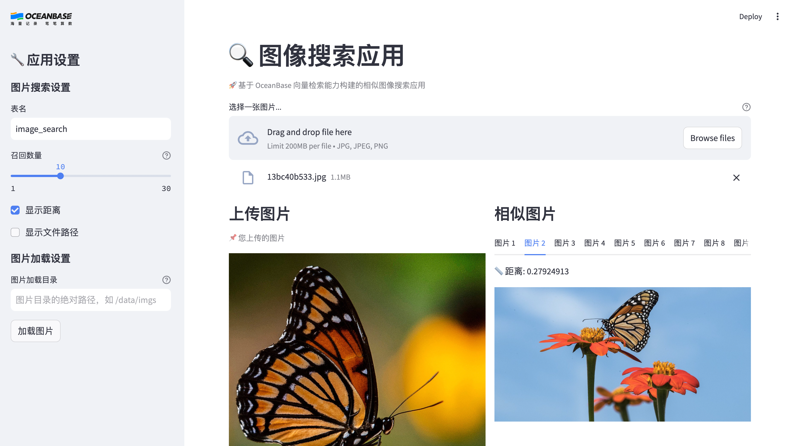

# 图像搜索应用

[English Edition](./README.md)

## 介绍

凭借 OceanBase 的向量存储和检索能力，我们可以构建一个图像搜索应用。该应用会把图像嵌入为向量中并存储在数据库中。用户可以上传图像，应用程序将搜索并返回数据库中最相似的图像。

注意：您需要自己在准备一些图像并将 `Image Base` 配置更新到打开的 UI 中。如果您本地没有可用的图像，可以在线下载数据集，例如在 Kaggle 上的 [Animals-10](https://www.kaggle.com/datasets/alessiocorrado99/animals10/data) 数据集。

## 准备工作

1. 安装 [Python 3.9](https://www.python.org/downloads/) 及以上版本及对应的 [Pip](https://pip.pypa.io/en/stable/installation/) 工具

2. 安装 [Docker](https://docs.docker.com/get-docker/) 用于启动 OceanBase 数据库容器

3. 安装 [Poetry](https://python-poetry.org/docs/) 作为依赖管理工具，可参考下面的命令

```bash
python3 -m pip install poetry
```

4. 获取 OceanBase 4.3.3 及以上版本的数据库连接信息，如果不打算在本地部署 OceanBase，可参考 OceanBase [开源版部署方案](https://open.oceanbase.com/quickStart)或者 [OceanBase Cloud](https://www.oceanbase.com/free-trial) 方案。

## 应用搭建步骤

### 1. 部署 OceanBase 集群

#### 1.1 启动 OceanBase docker 容器

如果你是第一次登录动手实战营提供的机器，你需要通过以下命令启动 Docker 服务：

```bash
systemctl start docker
```

随后您可以使用以下命令启动一个 OceanBase docker 容器：

```bash
docker run --ulimit stack=4294967296 --name=ob433 -e MODE=mini -e OB_MEMORY_LIMIT=8G -e OB_DATAFILE_SIZE=10G -e OB_CLUSTER_NAME=ailab2024 -p 127.0.0.1:2881:2881 -d quay.io/oceanbase/oceanbase-ce:4.3.3.0-100000142024101215
```

如果上述命令执行成功，将会打印容器 ID，如下所示：

```bash
af5b32e79dc2a862b5574d05a18c1b240dc5923f04435a0e0ec41d70d91a20ee
```

#### 1.2 检查 OceanBase 初始化是否完成

容器启动后，您可以使用以下命令检查 OceanBase 数据库初始化状态：

```bash
docker logs -f ob433
```

初始化过程大约需要 2 ~ 3 分钟。当您看到以下消息（底部的 `boot success!` 是必须的）时，说明 OceanBase 数据库初始化完成：

```bash
cluster scenario: express_oltp
Start observer ok
observer program health check ok
Connect to observer ok
Initialize oceanbase-ce ok
Wait for observer init ok
+----------------------------------------------+
|                 oceanbase-ce                 |
+------------+---------+------+-------+--------+
| ip         | version | port | zone  | status |
+------------+---------+------+-------+--------+
| 172.17.0.2 | 4.3.3.0 | 2881 | zone1 | ACTIVE |
+------------+---------+------+-------+--------+
obclient -h172.17.0.2 -P2881 -uroot -Doceanbase -A

cluster unique id: c17ea619-5a3e-5656-be07-00022aa5b154-19298807cfb-00030304

obcluster running
Trace ID: 08f99c98-8c37-11ef-ad07-0242ac110002
If you want to view detailed obd logs, please run: obd display-trace 08f99c98-8c37-11ef-ad07-0242ac110002
Get local repositories and plugins ok
Open ssh connection ok
Connect to observer ok
Create tenant test ok
Exec oceanbase-ce-4.3.3.0-100000142024101215.el8-3eee13839888800065c13ffc5cd7c3e6b12cb55c import_time_zone_info.py ok
Exec oceanbase-ce-4.3.3.0-100000142024101215.el8-3eee13839888800065c13ffc5cd7c3e6b12cb55c import_srs_data.py ok
obclient -h172.17.0.2 -P2881 -uroot@test -Doceanbase -A

optimize tenant with scenario: express_oltp ok
Trace ID: 3c50193c-8c37-11ef-ace2-0242ac110002
If you want to view detailed obd logs, please run: obd display-trace 3c50193c-8c37-11ef-ace2-0242ac110002
check tenant connectable
tenant is connectable
boot success!
```

使用 `Ctrl + C` 退出日志查看界面。

#### 1.3 测试数据库部署情况（可选）

可以使用 mysql 客户端连接到 OceanBase 集群，检查数据库部署情况。

```bash
mysql -h127.0.0.1 -P2881 -uroot@test -A -e "show databases"
```

如果部署成功，您将看到以下输出：

```bash
+--------------------+
| Database           |
+--------------------+
| information_schema |
| mysql              |
| oceanbase          |
| test               |
+--------------------+
```

### 2. 安装依赖

```bash
# 安装依赖
poetry install
```

### 3. 配置环境变量

我们提供了 `.env.example` 文件，您需要将其复制为 `.env` 文件并填入您的数据库连接信息。可参考下面的命令，

```bash
cp .env.example .env
# 重点修改 DB_HOST, DB_PORT, DB_USER, DB_PASSWORD, DB_NAME 几个变量
vi .env
```

### 4. 启动图像搜索 UI

```bash
# 启动图像搜索应用界面
poetry run streamlit run --server.runOnSave false image_search_ui.py
```

### 5. 处理并存储图像数据

打开应用界面之后，您可以在左侧侧边栏中看到“图片加载目录”的输入框，在其中填写您准备的图片目录的绝对路径，然后点击“加载图片”按钮。应用程序将处理并存储这些图像数据，您将在界面上看到图片处理进度。

### 6. 使用图像搜索

在图片处理完成后，您将在界面中上方看到图片上传操作栏，您可上传一张图片用于搜索相似图片。上传图片后，应用程序将搜索并返回数据库中最相似的一些图片，默认返回最相似的前 10 张图片。



## 常见问题

### 1. 遇到找不到 libGL.so.1 文件的报错怎么办？

如果您在运行应用 UI 时遇到了 `ImportError: libGL.so.1: cannot open shared object file` 的报错信息，可参考[该帖子](https://stackoverflow.com/questions/55313610/importerror-libgl-so-1-cannot-open-shared-object-file-no-such-file-or-directo)解决。

在 CentOS 操作系统中，执行以下命令,

```bash
sudo yum install mesa-libGL -y
```

在 Ubuntu/Debian 操作系统中，执行以下命令,

```bash
sudo apt-get install libgl1
```

### 2. 遇到找不到 pkg_resources 包的报错怎么办？

如果您在运行应用 UI 时遇到了 `ModuleNotFoundError: No module named 'pkg_resources'` 的报错信息，可参考[该帖子](https://stackoverflow.com/questions/7446187/no-module-named-pkg-resources)解决。

具体来说，可以参考下面两条命令，

```bash
python3 -m pip install --upgrade pip
python3 -m pip install setuptools
```
